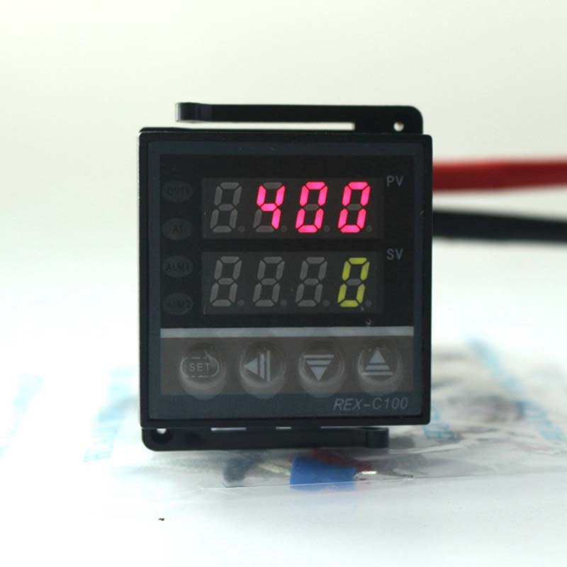
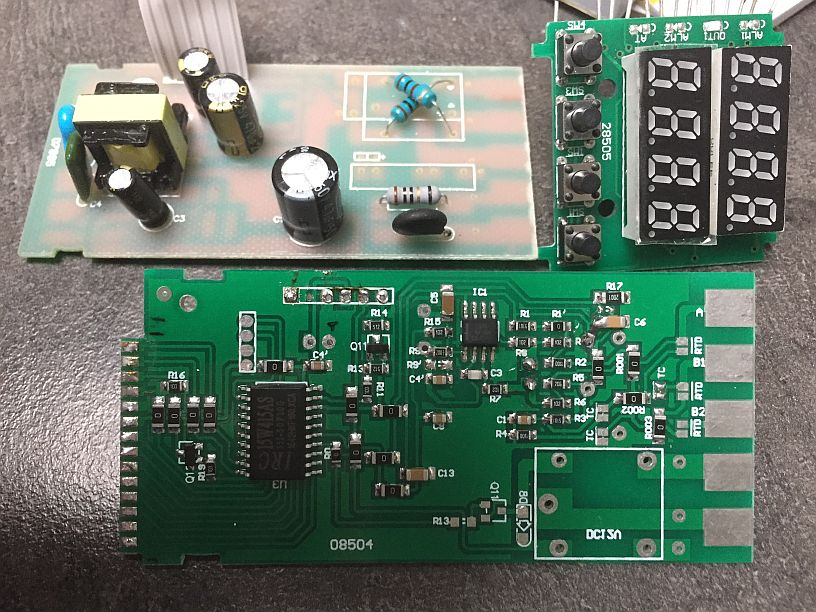
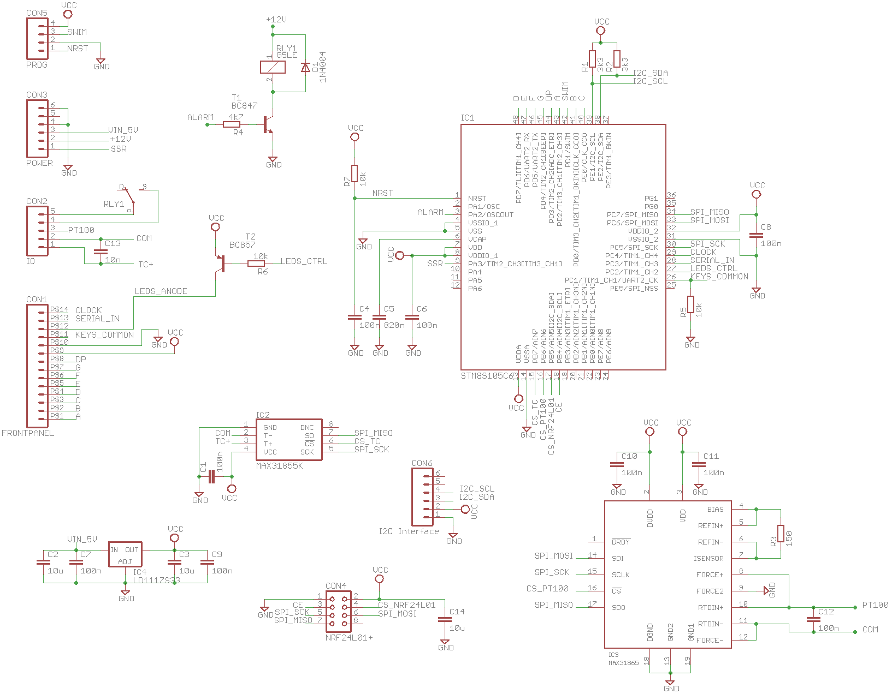
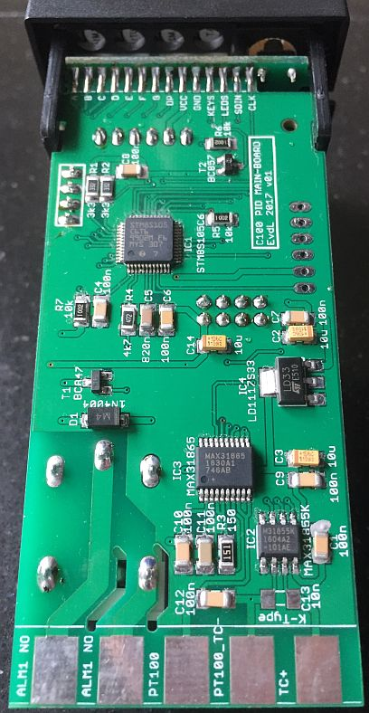
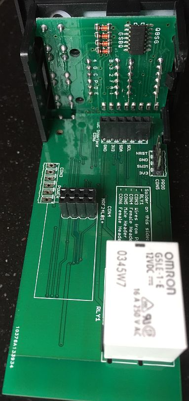

# C100_PID_Upgrade
------------------

  
*Picture of the frontpanel of a C100 PID controller*

The C100 PID Controller is very easy to find on ebay. For only $10-$15 you can have a PID controller with SSR output. Most package-deals also include a Solid-State Relay (SSR) and a thermocouple (K-type) temperature sensor. Not a bad deal, but if you open the device and look at it from an electrical engineering perspective, things are starting to look a bit different. The main purpose of the upgrade given here is to change the default functionality into that found in the [STC1000p firmware](https://github.com/Emile666/stc1000_stm8/), with the 6 temperature profiles and up-to 9 temperature-time pairs per profile.

The main disadvantages of this controller are:
- K-type thermocouples are not really accurate (±2 °C is quite common)
- The thermocouple interface does not add much to this accuracy. Basically it is a opamp with a gain of 200. Very cheap indeed, no cold-junction compensation and not very accurate.
- Although the PCB has the option of interfacing with a RTD (PT100) sensor, it is not populated. A PT100 would be better suited for a -50 ... + 100 °C range that homebrewers typically use.
- No selectable temperature profiles like the STC1000p has.
- No alarm output relay populated
- Only one frontpanel LED mounted

Advantages are:
- Very nice small package
- Nice frontpanel PCB with 2 x 4-digit 7-segment displays
- Four buttons
- 110-240 V AC power-supply

Internal hardware consists of three Printed-Circuit Boards (PCB): the frontpanel PCB, the power-supply PCB and the main-PCB (as we will call them from now on). The power-supply PCB takes care of converting the AC wall-outlet voltage into a fixed 12 V and a 5 V DC voltage. It also contains the SSR output function.

The frontpanel PCB contains the 7-segment display (top and bottom row of 4-digits), four buttons and one output LED. It is connected to the main-PCB via a 14 pin soldered connection.

The main-PCB contains the microcontroller and the temperaturesensor interface electronics. The microcontroller itself is some crappy Chinese 8051 clone without decent manuals.

  
*Picture of the 3 PCBs taken apart*

# C100 Features after upgrade
---------------------------
- All functionality as found in the [STC1000p firmware](https://github.com/Emile666/stc1000_stm8/).
- Alarm relay output added
- Reliable and accurate temperature interface, both for a K-type thermocouple as well as for a PT100 element
- Wireless communication via a **nRF24L01+** device
- **I2C**-interface available for a DS3231 Real-Time Clock (RTC) interface (so you can have date and time in your C100)
- Both a K-type thermocouple and a PT100 are supported. Not at the same time, but if you replace a thermocouple for a PT100 sensor, this will work without further hardware modifications. Which sensor is connected, is detected automatically by the firmware.

Hardware Upgrade
------------------
The power-supply PCB and the frontpanel PCB are kept as they are. Only addition made to the frontpanel PCB is to add 3 more LEDs (ALM1, ALM2 and AT). These are 0805 SMD type LEDs: ALM1 and ALM2 LEDs are red, the AT LED is green.

The main-PCB is desoldered from the frontpanel PCB and thrown away. The interface electronics is horrible and the cheap Chinese microcontroller is of not much use: I don't know how to program it and there's no information how to do this. Instead, a new main-PCB with a decent microcontroller (**STM8S105C6T6**) is made. Schematics and PCB-layout of this new main-PCB is given below.

Software upgrade
-----------------
A port of the STC1000p firmware is made and made available in the src subdirectory (this is work-in-progress)

Schematics and PCB design
-------------------------

The frontpanel PCB is reverse-engineered and schematics are made. This is needed to understand how the frontpanel PCB operates.

  
*Schematics of the frontpanel of the C100 PID controller*

Some interesting things can be seen from this:
- The Common-Anode lines (8 in total, one for every 7-segment display) are the outputs of a 74HC164 shift-register. The microcontroller controls this with the clock and serial_in lines.
- The keys are multiplexed with the Common-Anode lines from the 7-segment displays. When the displays are addressed, this line needs to be high. Reading the keys is done by enabling the CA lines one by one while checking if KEYS_COMMON line is high (key pressed) or low (not pressed). Furthermore, there's a pull-down resistor on these lines on the main-PCB.
- There's a separate LEDS_ANODE line for the four LEDs (of which only the OUT1 LED is populated). Set this low to disable the LEDs, high with the proper (B, F, A or D) line low enables the LED. A separate PNP transistor to drive this line is populated at the main-PCB.
- The 14 pin connector to the main-PCB is a soldered connection. Place the two PCBs against each other and solder every individual pin.
- The individual segments (a, b, c, d, e, f, g and dp) are connected via a 47R resistor directly to the main-PCB.

The main-PCB is created completely new:

  
*Schematics (new) of the main-PCB of the C100 PID controller*

- The new microcontroller is an **STM8S105C6T6** 48-pin LQFP device. More than capable of running everything. To program this device, the STVD (ST Visual Development) tool is used in combination with the Cosmic C compiler. This will give you 32 Kbyte code-size (and it is free of charge). See the [STC1000p_steroids](https://github.com/Emile666/stc1000p_steroids/) project for details.
- The new PCB has the exact same form-factor as the current PCB. It should therefore be easy to replace it and fit in the current housing
- CON1: the 14 pin soldered connection to the frontpanel
- CON2: this forms the connection with the outside world. The pads are the exact same size as in the original.
- CON3: there's a 6 wire flat-cable coming from the power-supply PCB. Resolder it in the same way as in the original. The flat-cable also contains the SSR-output connection (this function is present at the power-supply PCB).
- CON4: this connector is new and connects to a **nRF24L01+** device for wireless connection to a PC.
- CON5: this one is also new. It is a dedicated connector for programming and debugging. Connect it to the ST-Link V2 USB device (see also the [STC1000p project](https://github.com/Emile666/stc1000_stm8/)).
- CON6: this one is also new and forms an **I2C**-interface. Although optional, you could connect a DS3231 Real-Time Clock (RTC) to this. Or something else...
- The entire PCB runs at 3.3 V and has a dedicated voltage regulator (IC4) for it.
- The thermocouple interface is controlled by IC2, a **MAX31855K**, and will give you much more reliable readings than with the stock opamp amplifier. It uses the SPI bus to communicate with the µC.
- There's now also a PT100 interface, controlled by IC3, a **MAX31865**. You can connect either a PT100 sensor or a thermocouple sensor to the device (bot not both at the same time). The PT100 sensor is read first by the firmware. If it detects that it is NOT present, the thermocouple sensor is read.
- An alarm relay is added. It is able to switch 16 A at 230V. During normal operation, it is open and closed when an alarm is present.

  
*PCB frontpanel and soldered to existing frontpanel*

This picture shows how the components were soldered and how the connection to the existing frontpanel is made. The entire PCB fits nicely in the existing housing.

  
*Solder-side of new PCB board*

The solder-side contains the alarm relay and also the interfaces for the wireless interface and the Real-Time-Clock (RTC).

I have a limited number of PCBs available. Send me a PM if you would like to have one. But you can also create one yourself with the Eagle .sch and .brd files given here.

